## h1 Hei Ansiblen maailma
Tehtävänannot: [https://terokarvinen.com/palvelinten-hallinta/#h1-hei-ansiblen-maailma](https://terokarvinen.com/palvelinten-hallinta/#h1-hei-ansiblen-maailma)

*x) Lue ja tiivistä. (Tässä x-alakohdassa ei tarvitse tehdä testejä tietokoneella, vain lukeminen tai kuunteleminen ja tiivistelmä riittää. Tiivistämiseen riittää muutama ranskalainen viiva. Ei siis vaadita pitkää eikä essee-muotoista tiivistelmää. Lisää kuhunkin jokin oma kysymys tai huomio.)*
*[Karvinen 2026: SSH public key - Login without password](https://terokarvinen.com/ssh-public-key-login-without-password/)*  

- SSH:lla voi sisäänkirjautua  ilman salasanaa
- OpenSSH asennetaan koneelle, ja sen jälkeen generoidaan avainpari komennolla "ssh-keygen"
- avainparin julkinen puoli (.pub) kopioidaan siihen kohteeseen, johon haluaa sisäänkirjautua, joko manuaalisesti authorized_keys-tiedostoon tai komennolla ssh-copy-id *hostnimi*
- tämän jälkeen voi kirjautua kohteeseen komennolla "ssh user@host
- koin aiemmin ssh-avainten käytön jotenkin monimutkaisena, mutta sehän on oikeasti helppoa, kunhan muistaa miten käsitellä yksityistä ja julkista avainta

[Karvinen 2026: Hello Ansible](https://terokarvinen.com/hello-ansible/)

- Ansiblella voi hallinnoida konfiguraatioita, eli kuvailla minkälaisen lopputuloksen hosteille haluaa, ja Ansible suorittaa sen
- Ansible toimii SSH:n yli
- hosts.ini-tiedostossa luetellaan kontrolloitavat hostit, ja yml-tiedostoilla luodaan hosteille roolit ja rooleille tehtävät (task)
- lopuksi tehty ohjeistus eli "playbook" suoritetaan
- Ansiblen syntaksi vaikuttaa yksinkertaiselta, ainakin näin aluksi

*a) Sshecrets. Asenna SSH-demoni ja testaa se kirjautumalla SSH:lla.*

Asensin ssh:n komennolla ``sudo apt-get install -y ssh``

Kirjauduin localhostiin komennolla ``ssh localhost`` ja laitoin salasanan pyydettäessä. Komennolla `w` näkyy, että olen kirjautuneena tavallisesti ja lisäksi localhostilla.

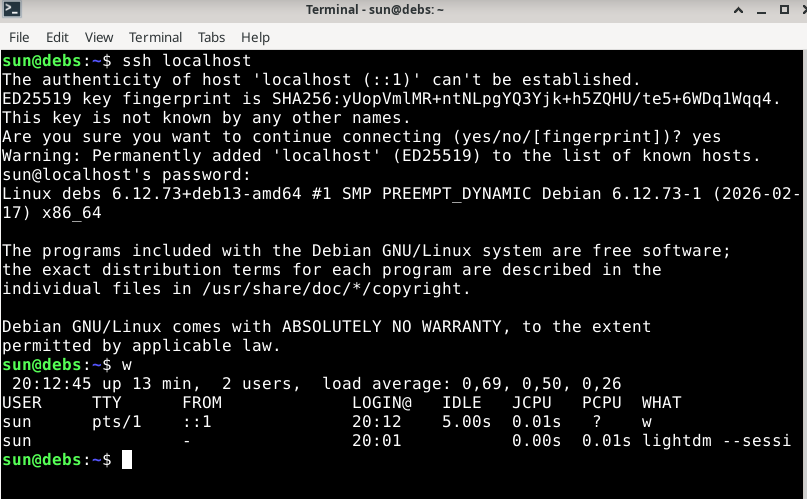

*b) Pubkey. Automatisoi ssh-kirjautuminen julkisella avaimella.*  
Generoin avainparin komennolla ``ssh-keygen``. 

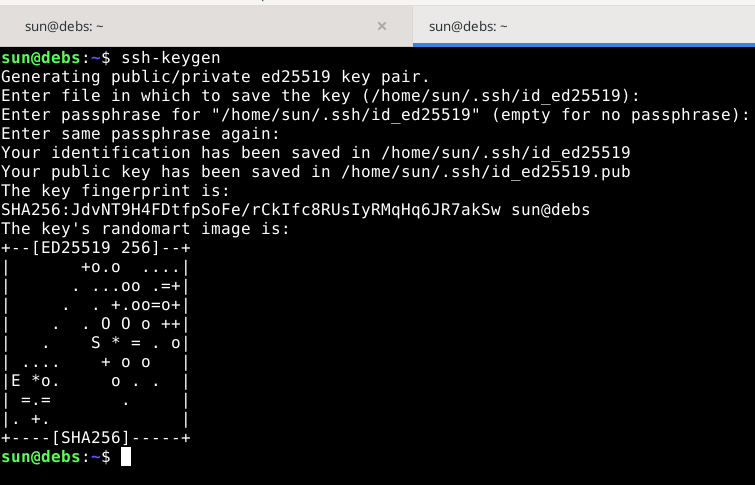

Kopioin julkisen avaimen localhostiin komennolla ``ssh-copy-id localhost``.

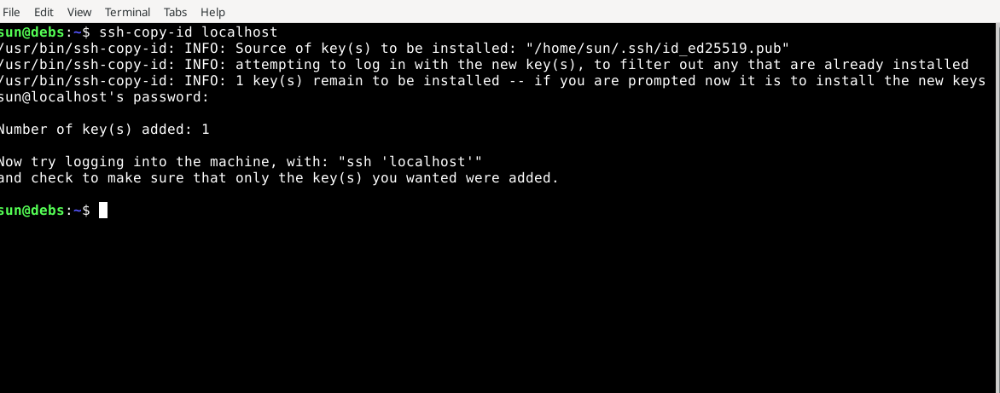

Nyt pystyin loggaamaan localhostiin komennolla ``ssh localhost`` ilman salasanaa.

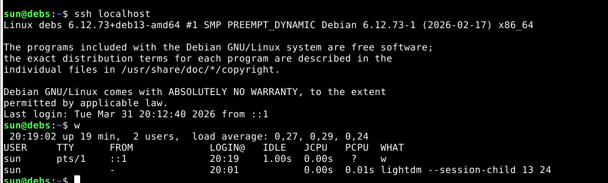

*c) Hei Ansible. Tee hei maailma ansiblella ja kokeile sitä SSH:n yli.*

Asensin ansiblen ja ohjeissa mainitut muut ohjelmat komennolla ``sudo apt-get install ansible micro bash-completion tree``. (Tosin itse olen tottunut käyttämään tekstieditorina nanoa.)

Tein tiedoston "hosts.ini", johon kirjoitin vain "localhost". Testasin uptimella, että ansible pääsi localhostiin SSH:lla. 

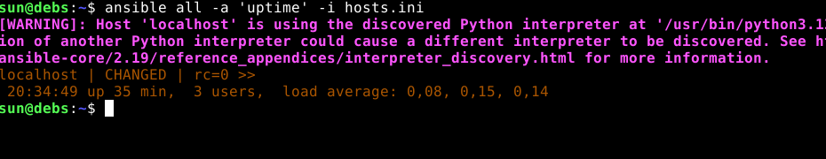

Lisäsin hosts.iniin pathin python-tulkkiin, jotta pääsin eroon ruudulla näkyneestä valituksesta.

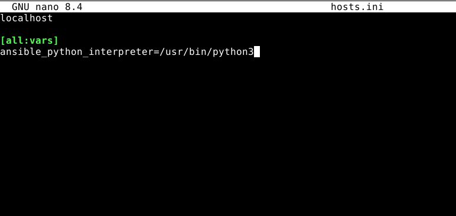

Tässä vaiheessa huomasin, että hosts.ini ei ollut ansible-kansiossa, joten siirsin sen sinne.

Tein ansible.cfg-tiedoston, johon lisäsin [defaults] inventory = hosts.ini, jotta komentoihin ei tarvitse enää lisätä hosts.inia.

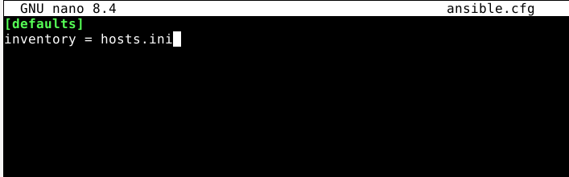

Tein site.yml-tiedoston ja sinne roolin "hei", jonka annoin kaikille hosteille.

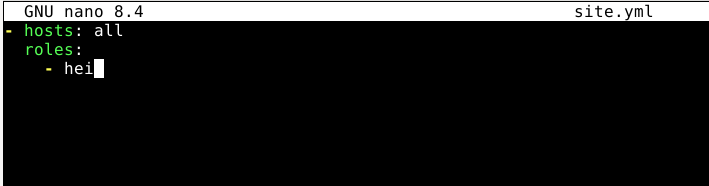

Tein kansion roles/hei/tasks/ ja sinne main.yml-tiedoston:

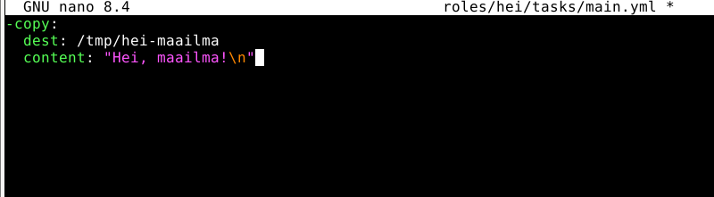

Yritin ajaa komennolla ``ansible-playbook site.yml``, mutta sain virheilmoituksen.

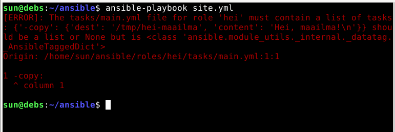

Korjasin syntaksin, eli välilyönnit eivät olleet oikein.

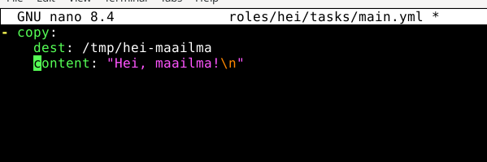

Ajoin playbookin uudelleen.

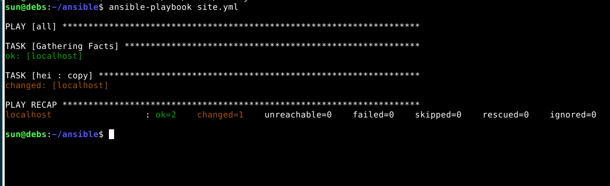

Komennolla ``ssh localhost cat '/tmp/hei-maailma/'`` näkyi, että localhostin tmp-hakemiston alakakansioon oli ilmestynyt kyseinen teksti.

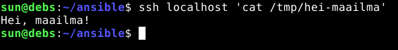

Lisäsin ansible.cfg:hen "display_args_to_stdout = true".

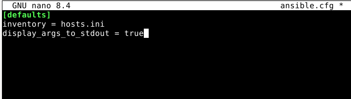

Näin teksti tulostui näytölle playbookin ajossa. Tällä kertaa mitään ei muutettu (changed=0), koska teksti oli jo aiemmin lisätty.

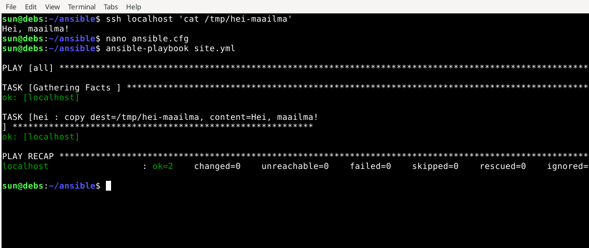

Lähteet: 
- [Karvinen 2026: Hello Ansible](https://terokarvinen.com/hello-ansible/) Luettu 31.3.2026. 
- [Karvinen 2026: SSH public key - Login without password](https://terokarvinen.com/ssh-public-key-login-without-password/) Luettu 31.3.2026.

