## h3 Demoni

x) Lue ja tiivistä. 
*[Karvinen 2026: Apache installed with Ansible - quick notes](https://terokarvinen.com/apache-ansible/)*

- Demonien asennus noudattaa kaavaa package-file-service, eli asennetaan demoni, asetetaan sille konfiguraatio tiedostoon ja sitten startataan
- Kun rooliin liitettyä tiedostoa on muutettu, se ilmoittaa roolin handlerille, että demoni täytyy käynnistää uudelleen, jotta muutokset tulevat voimaan
- Taskissa on kohta "notify", jonka sisältö viittaa handlerin nimeen, eli esim. notify: restart apache2 -> tämän jälkeen "restart apache" -niminen handleri uudelleenkäynnistää demonin

*Ansible Community Documentation: Handlers: running operations on change  
Handlers: running operations on change (johdantokappale pääotsikon alta)  
Notifying handlers*  

- Handlerit ovat taskeja, jotka ajetaan vain, jos niitä on "huomautettu"
- Yksi task voi sisältää monta handleria, jotka voidaan luetella yksitellen tai listana
- Handlerit suoritetaan siinä järjestyksessä, missä handlerit ovat, eivät siinä järjestyksessä, missä ne on lueteltu taskissa
- Jos useampi task kutsuu samaa handleria, suoritetaan handleri vain kerran

*ansible-doc service*: /johdantokappale (MODULE alta) / enabled /name / state / EXAMPLES*

- Service-moduulilla kontrolloidaan orjalla ajettavia palveluita 
- State- ja enabled-tiloista ainakin jomman kumman on oltava määriteltynä
- Jos enabled on true, palvelu käynnistetään, kun järjestelmä käynnistyy

*a) Apassi. Asenna Apache 2 käsin. Weppisivun tulee näkyä palvelimen etusivulla. Sivun tulee olla tavallisen käyttäjän muokattavissa, ilman root- tai sudo-oikeuksia.*

Koska Apache oli jo asennettu, niin poistin sen komennolla ``sudo apt-get purge apache2`` ja sitten asensin sen uudelleen ``sudo apt-get install apache2``. Localhostissa näkyi nyt Apachen oletussivu.

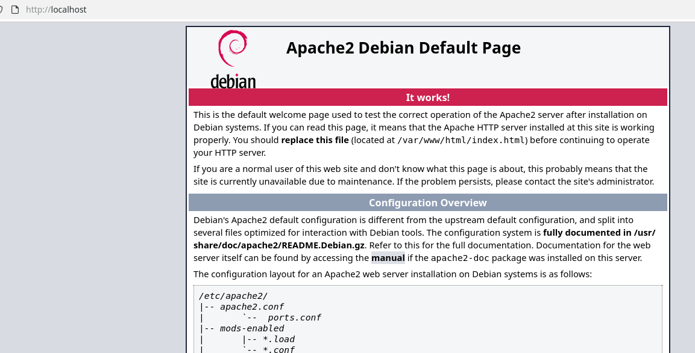

Tein kotihakemistoon /home/sun/publicsite tiedoston index.html, johon laitoin yksinkertaisen tekstin.

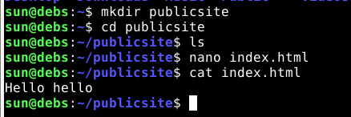

Tiedoston oikeudet olivat tarvittavat eli 0644, jotta Apache voi lukea tiedoston.

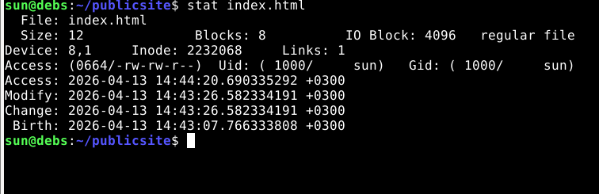

### Kansioiden oikeuksien muuttaminen

Jotta Apache pääsee tiedostoon, tarvitsi kansioiden oikeuksia muuttaa. Tässä meni ensin vähän metsään, kun muutin kansioiden oikeuksia komennolla ``chmod ugo+x .``, eli muokkasin sen kansion oikeuksia, jossa sillä hetkellä olin, mutta pian olinkin seonnut kansioissa.

Esimerkiksi tässä ensin katsoin kotihakemistoni oikeudet komennolla ``stat .``, ja sitten muutin ne komennolla ``chmod ugo+x .``, jotta oikeuksiksi tuli 0711. 

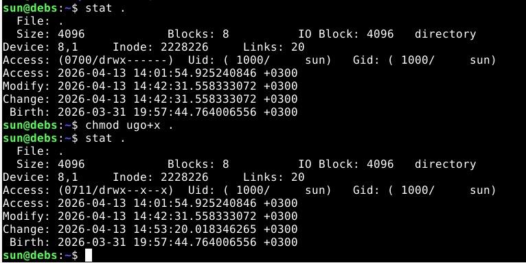

Publicsites-hakemistoon laitoin oikeuksiksi 0755, jotta Apache voi nähdä kaikki sivut kansiossa.

### Websites.conf-tiedosto

Lisäsin /etc/apache2/sites-available/-kansioon websites.conf-tiedoston, jonka muokkasin esimerkistä.

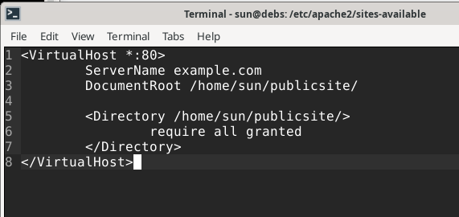

Käytin komentoa ``sudo a2ensite websites.conf`` enabloimaan websites.conf-tiedoston ja komennolla ``sudo a2dissite 000-default-conf`` disabloin oletussivun. Sitten komennon antaman ohjeen mukaisesti reloadasin Apachen.

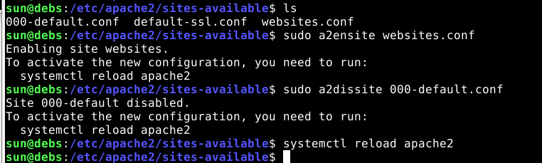

Menin selaimella localhostiin, ja siellä näkyi laittamani teksti.

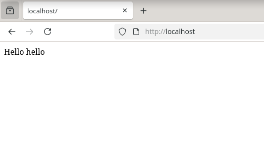

*b) Moottorix. Asenna Nginx käsin. Weppisivun tulee näkyä palvelimen etusivulla. Sivun tulee olla tavallisen käyttäjän muokattavissa, ilman root- tai sudo-oikeuksia. (Muista sammuttaa Apache ensin.)*

Suljin Apachen ``sudo systemctl stop apache2``.

Tein samalla tavalla kuin Apachen kanssa, eli kopioin /etc/nginx/sites-available-kansiosta oletuskonfiguraatio-tiedoston uudeksi tiedostoksi "website". 


```
server {
	listen 80;
	listen [::]:80;

	server_name example.com;

	root /home/sun/publicsite/;
	index index.html;

	location / {
		try_files $uri $uri/ =404;
	}
}
```

Tein siihen linkin sites-enables/-kansiosta ``sudo ln -s`` -komennolla.

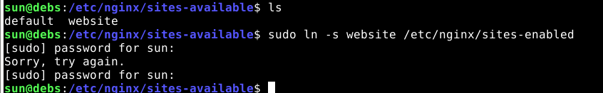

Testasin nginxin konfiguraation komennolla ``sudo nginx -t`` ja sain valituksen:

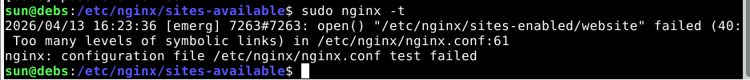

Selvittelin tätä aikani ja lopulta kysyin ChatGPT:ltä (Instant 5.3), joka neuvoi, että olin tehnyt linkin väärin, koska en käyttänyt siinä koko polkua. Tein linkin uudelleen kunnolla eli ``ls -n /etc/nginx/sites-available/website /etc/nginx/sites-enabled``. Sen jälkeen ngxinx -t meni läpi.


Uudelleenkäynnistin nginxin komennolla ``sudo systemctl restart nginx``, mutta selaimessa näkyi "Unable to connect". 

Tutkin nginxin logeja access.log ja error.log. Niiden avulla löysin vihjeen siitä, että nginx pyörii sittenkin, koska URL `http://localhost/index.nginx-debian.html` toimi. Selvisi, että olin jättänyt sivun konfatiedostoon kaiken koodin kommenttien sisään, ja sen lisäksi siinä oli väärä polku publicsite-kansioon. Ja sites-enabled-kansio oli tyhjä, vaikka mielestäni olin laittanut sinne uuden linkin.

Korjasin nuo asiat ja seuraavana virheenä tulikin 404, eli jonkinlaista edistystä.  Korjasin taas yhden kirjoitusvirheen hakemistopolussa, ja lopulta sivu näkyi.

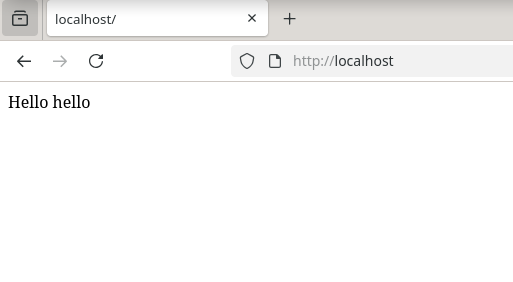

*c) Automoottorix. Automatisoi Nginx asennus Ansiblella. Ylläpitäjän osuus Ansiblella riittää, itse HTML-weppisivut voi tehdä käsin.*

### Taskit
Tein site.yml-tiedostoon uuden roolin "nginx". Nginx-roolille tein kansion /ansible/roles/nginx ja sinne main.yml-tiedoston. Aloitin laittamalla siihen vain apt-moduulin.


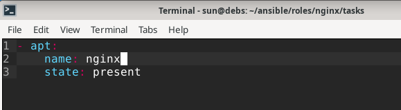

Playbook vaati sudon, jotta ansible sai paketin asetettua.

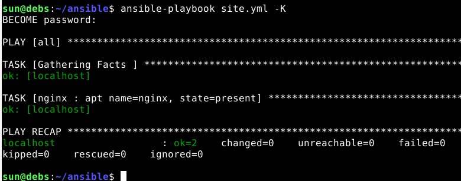

#### Copy-moduuli

Sitten tein Copy-moduulilla tiedoston kohdekoneen /etc/nginx/sites-available-hakemistoon, eli lisäsin copy-moduulin roles/nginx/tasks-kansion main.yml-tiedostoon. 


```
- copy:
    dest: "/etc/nginx/sites-available/website.conf"
    src: "website.conf"
    owner: "root"
    group: "root"
    mode: "0644"
  notify: restart nginx
```

Tässä vaiheessa unohdin tehdä sen tiedoston, joka kopioidaan orjalle, mutta Ansible ilmoitti siitä.

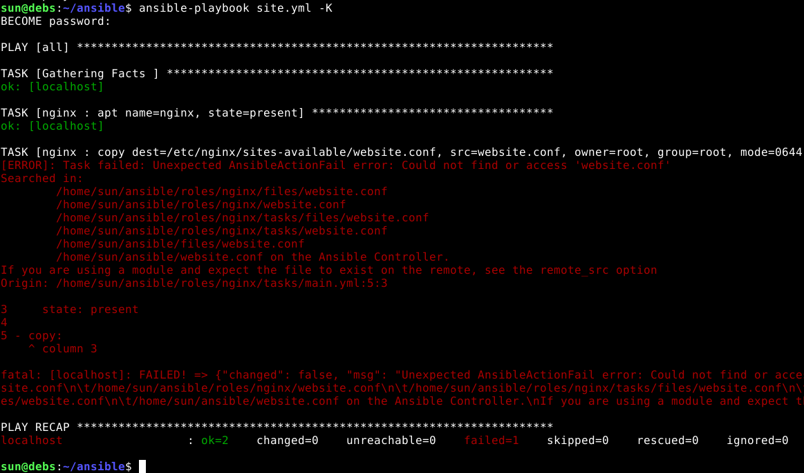

Kopioin aiemmin tekemäni website-tiedoston /etc/nginx/sites-availble/-kansiosta kansioon roles/nginx/files.

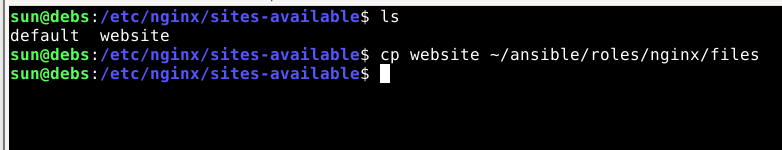

Poistin main.yml-syntaksista .conf-päätteet, jotka olivat päätyneet siihen esimerkistä.

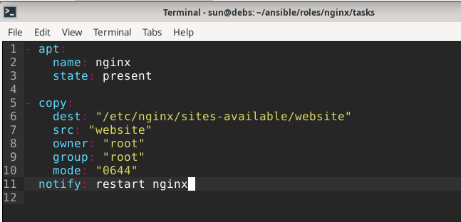

Nyt ansiblen ajo onnistui.

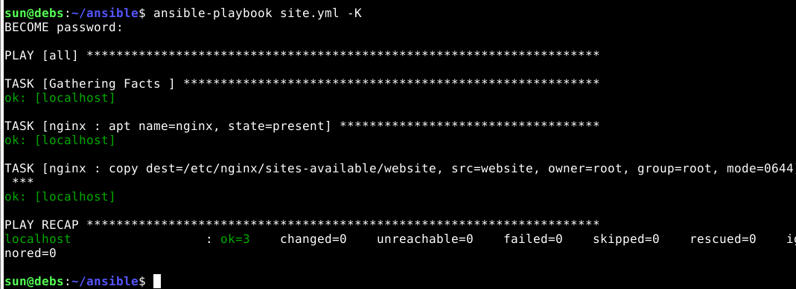

#### File-moduuli

File-moduulilla tein linkin sites-available-kansiosta sites-enable-kansioon.

```
- file:
    src: /etc/nginx/sites-available/website
    dest: /etc/nginx/sites-enabled/website
    owner: root
    group: root
    state: link
  notify: restart nginx
```

Ansiblen ajo meni läpi.

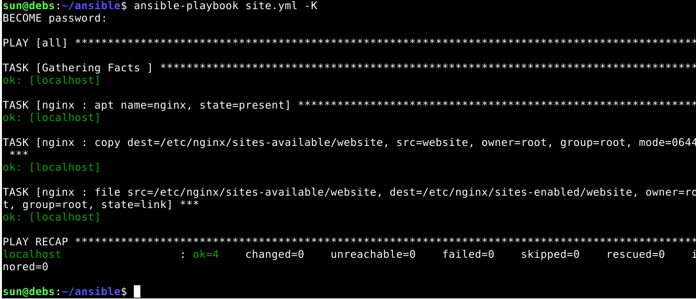

### Handleri

Sitten tarvittiin handleri, joka uudelleenkäynnistää nginxin, jos jotain on muuttunut. Tein kansioon /roles/nginx/handlers/ main.yml-tiedoston:

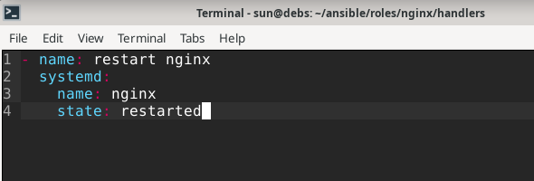

Nyt kun ajoin ansiblen, niin siinä ei näkynyt handlerista mitään. Halusin kokeilla, miten saisin handlerin triggeröityä. Deletoin website-tiedoston sites-available-kansiosta. Handler triggeröityi oikein kunnolla.

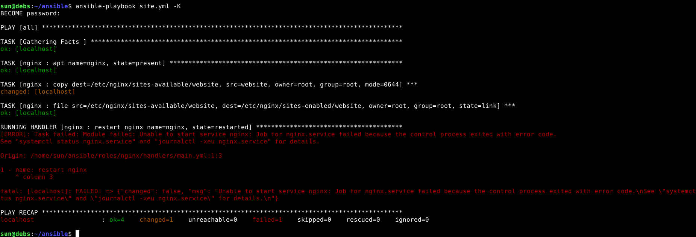

Luulin ensin, että syynä oli se, että olin deletoinut website-konfiguraatiotiedoston sites-available-kansiosta, mutta se oli edelleen sites-enabled-kansiossa. Deletoin konfatiedoston sites-enabled-kansiosta. Ansible oli ennen playbookin kaatumista kerennyt laittaa konfatiedoston takaisin sites-available-kansioon, ja jätin sen nyt sinne.

Mutta sainkin saman virheilmotuksen kuin aiemmassa ajossa. Handlers/main.ymlissa olikin joku muu ongelma.

Luin ansible-docia, mutta en löytänyt sieltä apua. Googlasin virheilmoituksen ja löysin [Stackoferflow-keskustelun](https://stackoverflow.com/questions/35868976/nginx-service-failed-because-the-control-process-exited). Sieltä löytyi vihje, että Apache saattaisi olla pyörimässä, joten pysäytin sen. Sitten taas deletoin website-tiedoston kansiosta sites-available ja sitten kansiosta sites-enabled.

Ilmeisesti Apache oli herännyt eloon, kun olin käynnistänyt koneen pidemmän tauon jälkeen, ja se esti Nginxin toimimisen. Tässä vaiheessa Ansiblen ajo ilmeisesti onnistui, mutta en ollutkaan ottanut siitä screenshottia. Toiminta näkyy kuitenkin vielä seuraavassa kohdassa.

### Ajo ilman salasanaa

Minun on ollut vaikea ymmärtää Ansiblen toimintaa, eli lähinnä sitä, että kuka käyttäjä tekee mitäkin. Sitä sotkee varmaankin se, että käytämme localhostia, jossa kone on koko ajan sama, ja kaikki tunnukset toimivat sekä masterissa että orjassa. 

Halusin vielä kokeilla sitä, että ajaisin playbookin ilman salasanaa. Käytin hyväkseni edellisen viikon tehtävää, jossa orjalle oli luotu uusi käyttäjä ja annettu sille sudo-oikeudet ilman salasanaa. Eli lisäsin site.yml-tiedostoon teesudo-roolin.

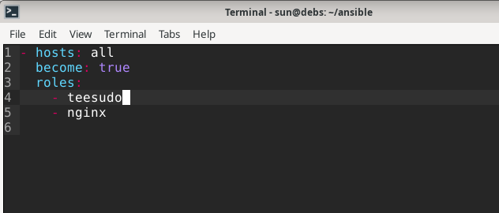

Nimeksi käyttäjälle laitoin "holli", ja muuten käytin samoja tietoja kuin edellisessä tehtävässä.

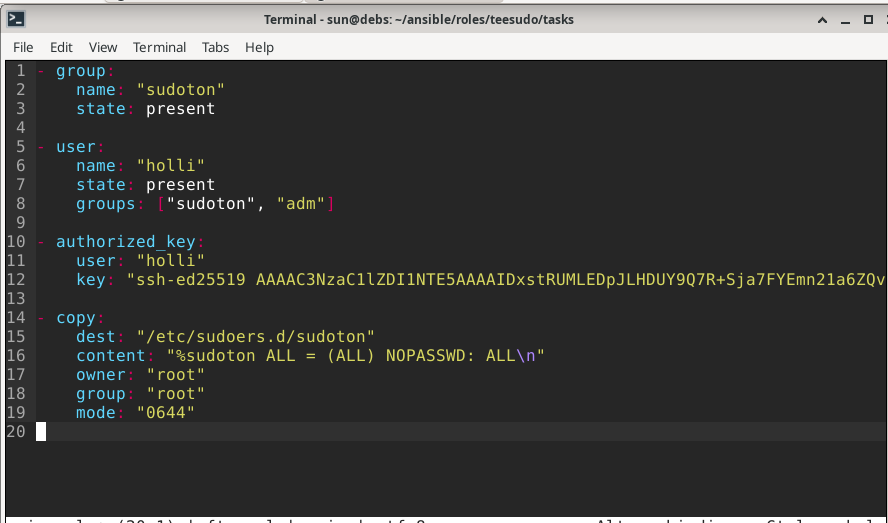

Ensimmäisen kerran kun ajoin playbookin, se vaati salasanan.

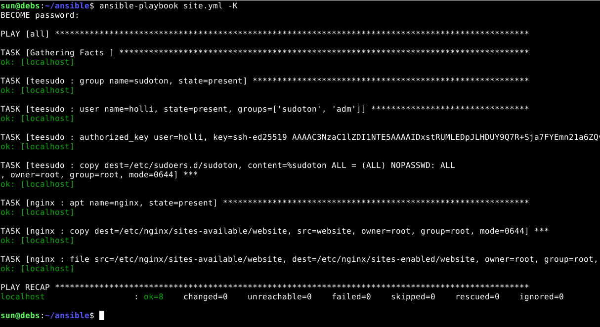

Toisella kertaa se ei pyytänyt, kun käytin komennossa -u holli. Nyt orjalla oli siis uusi käyttäjä holli, jonka avulla Ansible pystyi toteuttamaan myös sudoa vaativat taskit ilman salasanaa.

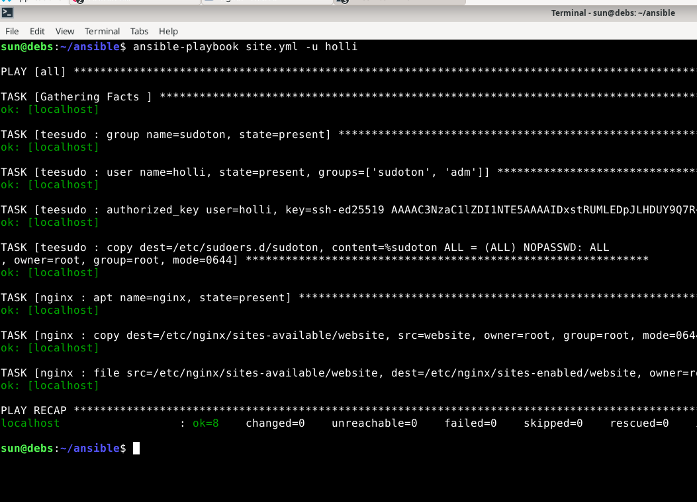

Onnistuneen ajon jälkeen deletoin sites-enabled-kansiosta website-linkin, jotta pystyisin testaamaan handlerin toimintaa.

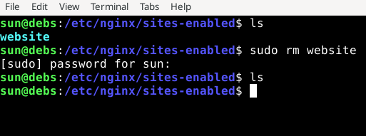

Ajoin playbookin uudelleen, ja nyt ajon lopussa näkyy, kuinka task lisäsi website-linkin, ja sen muutoksen takia handler uudelleenkäynnisti Nginxin.
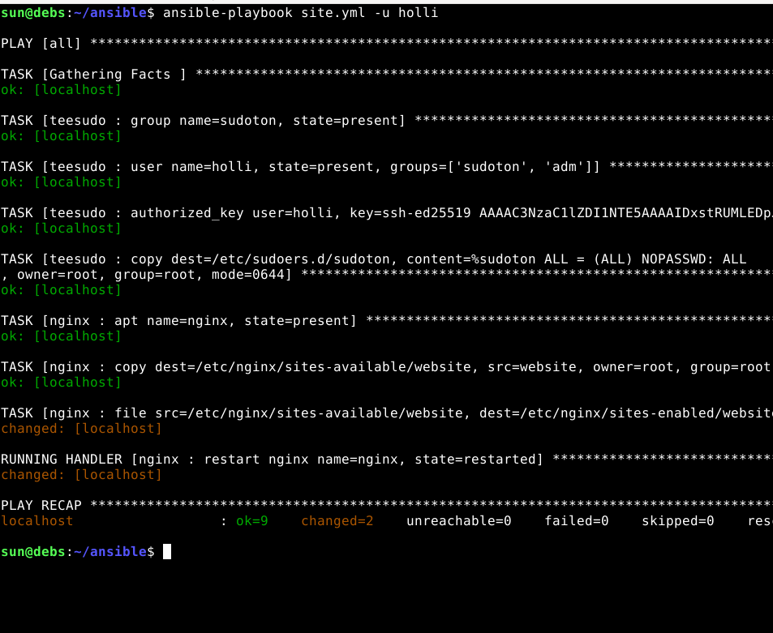

Ajan puutteen takia jätin nettisivu-kohdan tekemättä.

### Lähteet
  
- [Palvelinten hallinta - H3](https://terokarvinen.com/palvelinten-hallinta/#h3-demoni)
- [DigitalOcean.com - How To Set Up Nginx Server Blocks (Virtual Hosts) on Ubuntu 16.04](https://www.digitalocean.com/community/tutorials/how-to-set-up-nginx-server-blocks-virtual-hosts-on-ubuntu-16-04)  
- [Karvinen 2016: New Default Website with Apache2](https://terokarvinen.com/2016/new-default-website-with-apache2-show-your-homepage-at-top-of-example-com-no-tilde)  
- [Karvinen 2026: Apache installed with Ansible - quick notes](https://terokarvinen.com/apache-ansible/)

