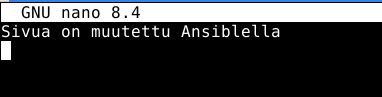
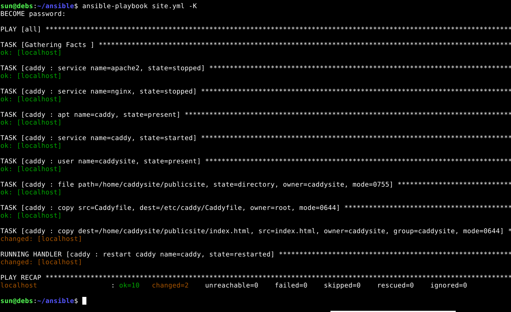
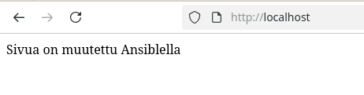
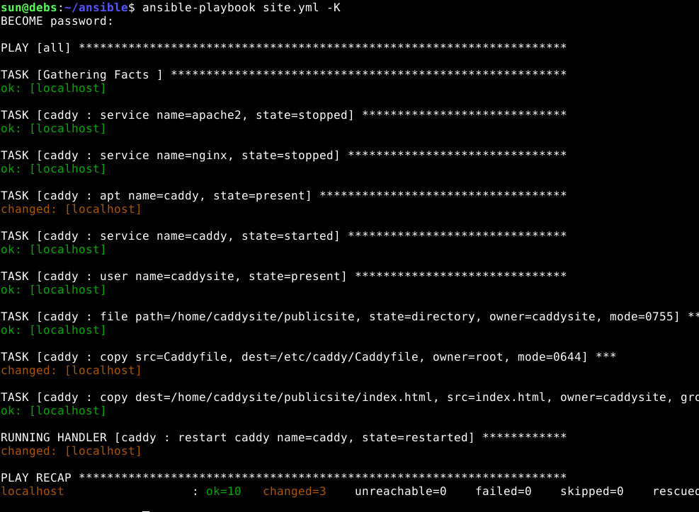
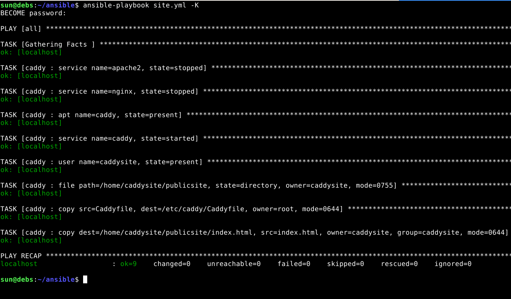

## h4 Pizza Fantasia

### x) Lue ja tiivistä. 
[Karvinen 2023: Configuration Management of Distributed Systems over Unreliable and Hostile Networks](https://westminsterresearch.westminster.ac.uk/item/w7vvz/configuration-management-of-distributed-systems-over-unreliable-and-hostile-networks)   
4.12.1 Size and Complexity of Some DSLs (112. Ominaisuuksien määrä.)  
4.12.2 Use of DSL Functions in Case Configuration (112-115. Mitä oikeasti käytetään.)  
4.12.3.1 Dependencies Between Main Functions (115-117. Tärkeimmät rakennuspalikat.)  

- Jotkin DLS: ovat hyvin monimutkaisia ja isoja
- Esimerkiksi Saltin DSL:ssä on 510 tilafunktiota, joiden dokumentaatio on yli 20 tuhatta riviä
- Puppetissa on 113 funktiota ja sen käyttämät rakenteet ovat hyvin erilaisia kuin yleisissä ohjelmointikielissä
- Vaikka ominaisuuksia on paljon, niin yleensä käytetään vain tiettyjä funktioita, kuten file, package ja service
- Yleinen käyttötarve on konfiguroida demoni tai sovellus, ja myös käyttäjiä ja käyttäjäryhmiä voidaan tarvita luoda
- Tärkeimmät funktiot demonille: package, file, service; sovellukselle: package, file; käyttäjänhallintaan: user, group; tiedostojen hallintaan: file, directory, symlink

### a) Räpylä. Asenna itse valitsemasi demoni käsin. Jokin muu kuin tunnilla tai kotitehtävissä aiemmin asennettu, eli ei apache, ngninx eikä openssh-server. Kuten aina, testaa lopputulos.

Asensin Caddyn komennolla ``sudo apt-get install caddy``. Kun tarkistin sen tilan, sain virheilmoituksen "failed". Katsoin onko Apache tai Nginx päällä, ja Nginx oli. Stoppasin Nginxin, mutta Caddy ei halunnut edelleenkään mennä päälle, joten restarttasin VM:n.

Uudelleenkäynnistämisen jälkeen Caddy meni itsekseen päälle. Olin disabloinut Apachen ja Nginxin, etteivät ne tule häiritsemään.


Localhostissa näkyi Caddyn vino oletussivu.


Konfiguraatiotiedosto "Caddyfile" on kansiossa /etc/caddy. Vaihdoin sinne aiemmassa tehtävässä tekemäni index.html-sivuni kansion ``home/sun/publicsite``.


Uudelleenkäynnistin Caddyn, ja nyt localhostissa näkyi sen sisältö.


Caddy oli siis asennettu, ja se näytti käyttäjän kotihakemistossa olevan index.html-sivun.

### b) Automaatti. Automatisoi valitsemasi demonin asennus Ansiblella.

Tein uuden roolin caddy ja aloin rakentaa playbookia roles/caddy/tasks-kansion main.yml-tiedostoon. Tein playbookin vaihe vaiheelta ja ajoin aina playbookin jokaisen vaiheen jälkeen. Ajoja oli monta ja virheitä paljon, mutta en dokumentoinut niitä tähän raporttiin, koska ne eivät olleet mitään erityisiä virheitä vaan kertoivat aina vain siitä, että jotain vielä puuttui tai tein asioita väärässä järjestyksessä. Esimerkiksi käyttäjää ei ollut, ja yritin tehdä käyttäjälle kansion, tai olin sekoittanut copy- ja file-moduulien syntaksit.

Lopullinen tasks/main.yml näkyy alla. Sen lisäksi tein caddy-roolille kansion roles/files, johon laitoin Caddyfilen sekä index.html, jotta ne voidaan kopioida orjalle.

Playbook ensin pysäyttää Apachen ja Nginxin ja asentaa sitten Caddyn, sekä varmistaa, että se on käynnissä. Sen jälkeen luodaan käyttäjä ja käyttäjälle publicsite-hakemisto. 

Caddyn konfiguraatiotiedosto kopioidaan roolin files-hakemistosta kansioon /etc/caddy. Sitten kutsutaan handleria, jotta Caddy lataa muuttuneen tiedoston. Lopuksi kopioidaan index-sivu käyttäjän publicsite-kansioon, ja jälleen kutsutaan handleria.


```
- service:
    name: apache2
    state: stopped

- service:
    name: nginx
    state: stopped

- apt:
    name: caddy
    state: present

- service:
    name: caddy
    state: started

- user:
    name: "caddysite"
    state: present

- file:
    path: /home/caddysite/publicsite
    state: directory
    owner: caddysite
    mode: '0755'

- copy:
    src:  "Caddyfile"
    dest: /etc/caddy/Caddyfile
    owner: root
    mode: '0644'
  notify: restart caddy

- copy:
    dest: /home/caddysite/publicsite/index.html
    src: "index.html"
    owner: caddysite
    group: caddysite
    mode: '0644'
  notify: restart caddy

```

Playbookin ajo (ilman muutoksia).  


Playbookin rakenne alla. Olen poistanut kuvasta ne roolit, joita ei tässä tehtävässä käytetä.


### c) Asetus. Muuta asetustiedostoa herralla (master, "control node") ja aja ansible uudestaan. Osoita, että asetukset tulivat käyttöön.

Muutin index.html-tiedoston sisältöä



Playbookin ajossa näkyi, että index.html on kopioitu uudelleen ja Caddy on uudelleenkäynnistetty.


Localhostissa näkyi muutettu teksti.



### d) Paikka remonttiin. Riko jotain asetuksia. Voit esimerkiksi poistaa demonin 'sudo apt-get purge foobar' (purge poistaa myös asetustiedostoja), poistaa asennuksen yhteydessä tulevan kansion (sudo rm -r /etc/foobar/ # vaarallista) tms. Ja sitten ajaa ansible-roolisi uudestaan ja todeta, että se korjaa tilanteen

Poistin Caddyn komennolla ``sudo apt-get purge caddy``. Sitten ajoin playbookin uudelleen. Tulosteesta näkyy, että Caddy on asennettu ja se on mennyt itsestään päälle. Käyttäjä caddysite, sen kansio, sekä index.html olivat jo olemassa, joten niihin ei ole tehty muutoksia. Caddyfile on kopioitu Caddyn omaan konfiguraatiohakemistoon, ja siksi lopuksi Caddy on käynnistetty uudelleen. Lopuksi vielä tarkistin, että localhostissa näkyi sama teksti kuin edellisessä tehtävässä, kun olin muuttanut index.html-tiedoston sisältöä. 



### e) Idempotentti. Osoita, että tilasi on idempotentti.

Kun Playbookin ajossa ei tule muutoksia, niin tila on idempotentti.




Asennuksissa tuli siis paljon virheitä, joita en ehtinyt dokumentoimaan. Olin muun muassa kirjoittanut playbookiin "chmod" enkä "mode", ja sen huomasin vasta siinä vaiheessa, kun olin poistanut Caddyfilen, jotta voisin "korjata" sen Ansiblella. Tämä johtui siitä, että Caddy taisi olla alun alkaen koneellani asennettuna (käsin), joten kaikkia muutoksia ei ajettu playbookilla. Eli playbookissa on mahdollista olla vääränlaisia vaihtoehtoja, eikä sitä välttämättä huomaa, ennen kuin Ansible ajaa juuri sen moduulin.

Olin myös antanut kopioitavalle Caddyfile-tiedostolle liikaa oikeuksia, minkä huomasin kun se oli kansiossa vihreällä fontilla eikä normaalin valkoinen. ChatGPT:n mukaan vihreä tarkoittaa suoritettavaa tiedostoa, joten muutin sen oikeudet 0755 -> 0644.

En ollut aluksi tehnyt playbookiin yhtään handlereita, mutta kun arvioitin playbookini ChatGPT:llä, niin sen jälkeen lisäsin handlerit, koska muutoin Caddy ei lataa muutoksia, joita konfiguraatiotiedostoihin tehdään. Tätäkään en ollut itse huomannut, koska en ollut aina varmistanut, että sen lisäksi, että playbookin ajo meni läpi, niin muutosten pitäisi myös oikeasti näkyä koneella. 

### Lähteet

- [Tehtävänanto, Palvelintenhallinta h4](https://terokarvinen.com/palvelinten-hallinta/#h4-pizza-fantasia)
- [Caddyserver.com - Using the service](https://caddyserver.com/docs/running#using-the-service)
